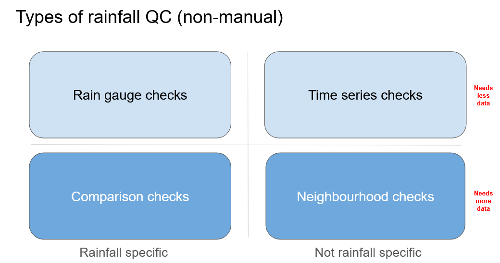

============
Introduction
============

This package provides tools for running quality control (QC) on rain gauge data in a flexible, user-driven way.
It is designed to help everyone, from individual researchers to industrial-scale users, apply standardised QC checks to rainfall observations whether you have one rain gauge or a whole network of rain gauges.

At its core, the package offers:

- 25 QC checks for precipitation data (all derived from `IntenseQC <https://www.sciencedirect.com/science/article/pii/S1364815221002127>`_)
- Customizable parameters – adjust thresholds, streak or accumulation lengths, and distances to neighboring gauges
- A modular QC framework – users can select which QC methods to apply, and configure them according to their project’s requirements

This approach allows you to build a tailored QC pipeline: include only the checks you need, set thresholds that match your research purposes, and run consistent, reproducible quality control.

What type of checks are in the package?
---------------------------------------
The *RainfallQC* package breaks down the QC checks into four distinct types:

- **Gauge checks** –  For detecting abnormalities in summary and descriptive statistics.
- **Comparison checks** – For detecting abnormalities based on rainfall benchmarks.
- **Time-series checks** – For detecting abnormalities in patterns of the data record.
- **Neighbourhood checks** – For detecting abnormalities based on measurements in neighbouring rain gauges.

These different types of rainfall checks are either rainfall-specific or not and need different amounts of data to run (Figure 1).

   Figure 1. Types of checks within RainfallQC
