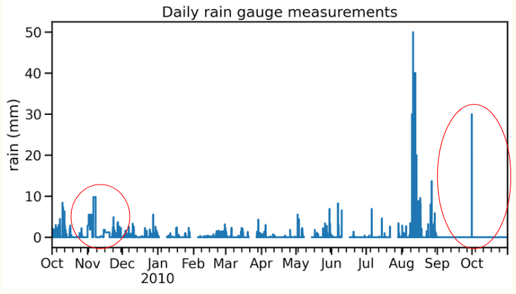
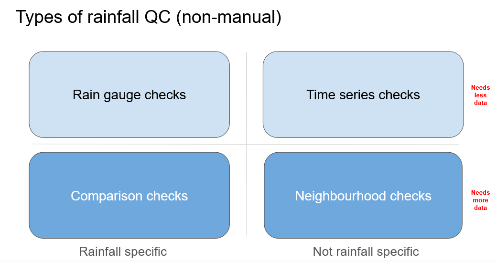

============
Introduction
============

   Do you need to quality control your rainfall data?

This package provides tools for quality controlling rain gauge data in a flexible, user-driven way.
It is designed to help everyone apply standardised quality control (QC) checks to rainfall observations, whether you have one rain gauge or a whole network of rain gauges.

At its core, the package offers:

- 27 QC checks for rainfall data as of v0.2.5 (25 from `IntenseQC <https://www.sciencedirect.com/science/article/pii/S1364815221002127>`_ and 2 from `pyPWSQC <https://doi.org/10.5281/zenodo.4501919>`_)
- Customizable parameters – adjust thresholds, streak or accumulation lengths, and distances to neighboring gauges
- A modular QC framework – users can select which QC methods to apply, and configure them according to their project’s requirements

This approach allows you to build a tailored QC pipeline: include only the checks you need, set thresholds that match your research purposes, and run consistent, reproducible quality control.

What type of checks are in the package?
---------------------------------------
The *RainfallQC* package breaks down the QC checks into four distinct types:

- **Gauge checks** –  For detecting abnormalities in summary and descriptive statistics.
- **Comparison checks** – For detecting abnormalities based on rainfall benchmarks.
- **Time-series checks** – For detecting abnormalities in patterns of the data record.
- **Neighbourhood checks** – For detecting abnormalities based on measurements in neighbouring rain gauges.
- **pypwsqc filters** – For applying quality assurance protocols and filters for rainfall data.

These different types of rainfall checks are either rainfall-specific or not and need different amounts of data to run (Figure 1).

   Types of checks within RainfallQC

All QC checks in package
------------------------
These are the quality control checks currently implemented in the package:

.. table:: All QC checks
   :widths: auto
   :align: left

   ================================================================================================================================================================  ====================  ====================================================================================  ===============
   Check                                                                                                                                                             Sub-module            QC Framework                                                                          Note
   ================================================================================================================================================================  ====================  ====================================================================================  ===============
   `Percentiles <api/generated/rainfallqc.checks.gauge_checks.html#rainfallqc.checks.gauge_checks.check_years_where_nth_percentile_is_zero>`_                        Gauge checks          `IntenseQC <https://www.sciencedirect.com/science/article/pii/S1364815221002127>`_    QC1
   `K-largest <api/generated/rainfallqc.checks.gauge_checks.html#rainfallqc.checks.gauge_checks.check_years_where_annual_kth_largest_value_is_zero>`_                Gauge checks          IntenseQC                                                                             QC2
   `Days of week <api/generated/rainfallqc.checks.gauge_checks.html#rainfallqc.checks.gauge_checks.check_temporal_bias>`_                                            Gauge checks          IntenseQC                                                                             QC3
   `Hours of day <api/generated/rainfallqc.checks.gauge_checks.html#rainfallqc.checks.gauge_checks.check_temporal_bias>`_                                            Gauge checks          IntenseQC                                                                             QC4
   `Intermittency <api/generated/rainfallqc.checks.gauge_checks.html#rainfallqc.checks.gauge_checks.check_intermittency>`_                                           Gauge checks          IntenseQC                                                                             QC5
   `Breakpoints <api/generated/rainfallqc.checks.gauge_checks.html#rainfallqc.checks.gauge_checks.check_breakpoints>`_                                               Gauge checks          IntenseQC                                                                             QC6
   `Minimum value change <api/generated/rainfallqc.checks.gauge_checks.html#rainfallqc.checks.gauge_checks.check_min_val_change>`_                                   Gauge checks          IntenseQC                                                                             QC7
   `R99p <api/generated/rainfallqc.checks.comparison_checks.html#rainfallqc.checks.comparison_checks.check_annual_exceedance_etccdi_r99p>`_                          Comparison checks     IntenseQC                                                                             QC8
   `PRCPTOT <api/generated/rainfallqc.checks.comparison_checks.html#rainfallqc.checks.comparison_checks.check_annual_exceedance_etccdi_prcptot>`_                    Comparison checks     IntenseQC                                                                             QC9
   `World Record <api/generated/rainfallqc.checks.comparison_checks.html#rainfallqc.checks.comparison_checks.check_exceedance_of_rainfall_world_record>`_            Comparison checks     IntenseQC                                                                             QC10
   `Rx1day <api/generated/rainfallqc.checks.comparison_checks.html#rainfallqc.checks.comparison_checks.check_hourly_exceedance_etccdi_rx1day>`_                      Comparison checks     IntenseQC                                                                             QC11
   `CDD (Dry spells) <api/generated/rainfallqc.checks.timeseries_checks.html#rainfallqc.checks.timeseries_checks.check_dry_period_cdd>`_                             Timeseries checks     IntenseQC                                                                             QC12
   `Daily accumulations <api/generated/rainfallqc.checks.timeseries_checks.html#rainfallqc.checks.timeseries_checks.check_daily_accumulations>`_                     Timeseries checks     IntenseQC                                                                             QC13
   `Monthly accumulations <api/generated/rainfallqc.checks.timeseries_checks.html#rainfallqc.checks.timeseries_checks.check_monthly_accumulations>`_                 Timeseries checks     IntenseQC                                                                             QC14
   `Streaks <api/generated/rainfallqc.checks.timeseries_checks.html#rainfallqc.checks.timeseries_checks.check_streaks>`_                                             Timeseries checks     IntenseQC                                                                             QC15
   `Daily neighbours (wet) <api/generated/rainfallqc.checks.neighbourhood_checks.html#rainfallqc.checks.neighbourhood_checks.check_wet_neighbours_daily>`_           Neighbourhood checks  IntenseQC                                                                             QC16
   `Hourly neighbours (wet) <api/generated/rainfallqc.checks.neighbourhood_checks.html#rainfallqc.checks.neighbourhood_checks.check_wet_neighbours_hourly>`_         Neighbourhood checks  IntenseQC                                                                             QC17
   `Daily neighbours (dry) <api/generated/rainfallqc.checks.neighbourhood_checks.html#rainfallqc.checks.neighbourhood_checks.check_dry_neighbours_daily>`_           Neighbourhood checks  IntenseQC                                                                             QC18
   `Daily neighbours (dry) <api/generated/rainfallqc.checks.neighbourhood_checks.html#rainfallqc.checks.neighbourhood_checks.check_dry_neighbours_hourly>`_          Neighbourhood checks  IntenseQC                                                                             QC19
   `Monthly neighbours <api/generated/rainfallqc.checks.neighbourhood_checks.html#rainfallqc.checks.neighbourhood_checks.check_monthly_neighbours>`_                 Neighbourhood checks  IntenseQC                                                                             QC20
   `Timing offset <api/generated/rainfallqc.checks.neighbourhood_checks.html#rainfallqc.checks.neighbourhood_checks.check_timing_offset>`_                           Neighbourhood checks  IntenseQC                                                                             QC21
   `Pre-QC affinity index <api/generated/rainfallqc.checks.neighbourhood_checks.html#rainfallqc.checks.neighbourhood_checks.check_neighbour_affinity_index>`_        Neighbourhood checks  IntenseQC                                                                             QC22
   `Pre-QC pearson correlation <api/generated/rainfallqc.checks.neighbourhood_checks.html#rainfallqc.checks.neighbourhood_checks.check_neighbour_correlation>`_      Neighbourhood checks  IntenseQC                                                                             QC23
   `Daily factor <api/generated/rainfallqc.checks.neighbourhood_checks.html#rainfallqc.checks.neighbourhood_checks.check_daily_factor>`_                             Neighbourhood checks  IntenseQC                                                                             QC24
   `Monthly factor <api/generated/rainfallqc.checks.neighbourhood_checks.html#rainfallqc.checks.neighbourhood_checks.check_monly_factor>`_                           Neighbourhood checks  IntenseQC                                                                             QC25
   `Faulty Zeros <api/generated/rainfallqc.checks.pypwsqc_filters.html#rainfallqc.checks.pypwsqc_filters.check_faulty_zeros>`_                                       pyPWSQC filters       `pyPWSQC <https://doi.org/10.5281/zenodo.4501919>`_                                   FZ
   `Station Outliers <api/generated/rainfallqc.checks.pypwsqc_filters.html#rainfallqc.checks.pypwsqc_filters.check_station_outlier>`_                                pyPWSQC filters       pyPWSQC                                                                               SO
   ================================================================================================================================================================  ====================  ====================================================================================  ===============
